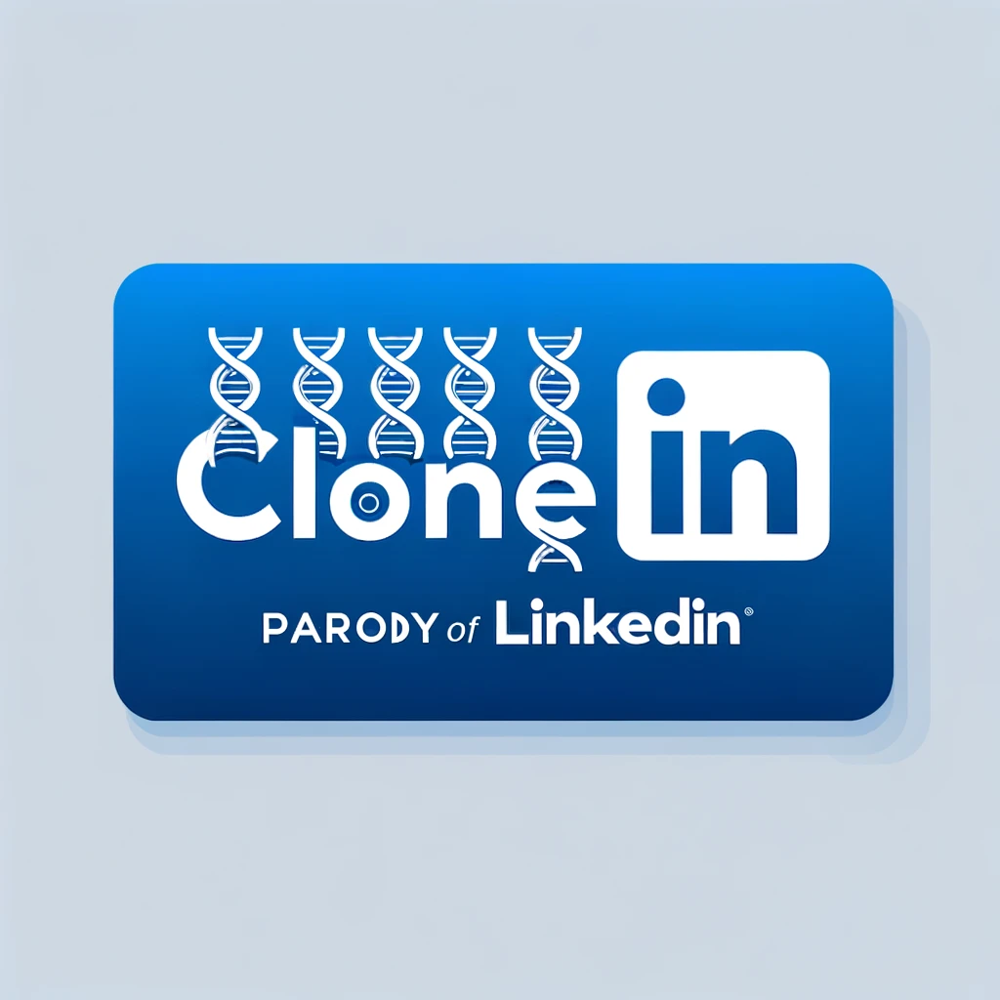

## Progetto di gruppo del TEAM5 BW3 FS0723

  
   
  
  

<a href="https://linkedinclone-pi.vercel.app/">Visita il sito!</a>

<h1 align="center" style="font-size: 60px; line-height: 60px; vertical-align: middle;">  
  
</h1>

  
  
  
  
  
  

## Tecnologie Usate
Il cuore del nostro progetto è il framework **React**, implementato tramite il moderno package **Vite** che garantisce un avvio rapido dell'ambiente di sviluppo e una ricompilazione istantanea. Per ottimizzare la navigazione e garantire un'esperienza utente fluida, abbiamo integrato **react-router-dom**, che ci permette di gestire in maniera dinamica le rotte e di catturare parametri specifici come l'`userId` in `profile/:userId`. La gestione dello stato dell'applicazione è affidata a **Redux**, che centralizza lo stato e permette una gestione trasparente e prevedibile delle modifiche attraverso azioni e reducer, facilitando così le operazioni di fetch dati all'avvio dell'app.

### Caratteristiche Principali
- **Navigazione fluida e intuitiva**: Grazie a React Router, gli utenti possono navigare tra le pagine con estrema fluidità, godendo di una esperienza utente ininterrotta e di transizioni immediate.
- **Gestione dello stato globale avanzata**: L'utilizzo di Redux permette di mantenere lo stato dell'applicazione organizzato e accessibile, semplificando la gestione dei dati attraverso l'interfaccia utente.
- **Design reattivo e attento ai dettagli**: Abbiamo prestato particolare attenzione alla responsività, assicurandoci che il nostro progetto si adatti perfettamente a qualsiasi dimensione di schermo. Questo, insieme all'uso di Bootstrap, garantisce un design coerente e accessibile, con una cura meticolosa dei dettagli per offrire un'esperienza visiva gradevole e professionale.
- **Sviluppo agile con Vite**: La scelta di Vite come strumento di sviluppo enfatizza la nostra dedizione alla velocità e all'efficienza, consentendo tempi di avvio rapidissimi e un hot-reloading che accelera notevolmente il ciclo di sviluppo.

Oltre a queste caratteristiche fondamentali, abbiamo implementato una serie di easter egg e funzionalità nascoste per gestire gli errori di navigazione in modo creativo e divertente, aggiungendo un tocco di unicità e personalità al nostro progetto. Questi dettagli sorprendenti non solo migliorano l'esperienza dell'utente ma dimostrano anche la nostra capacità di pensare fuori dagli schemi. Abbiamo dedicato molte risorse per assicurare che la nostra applicazione riflettesse accuratamente l'estetica e la funzionalità del sito di riferimento, pur introducendo miglioramenti e personalizzazioni che ne elevano l'usabilità e l'esperienza complessiva.

In conclusione, il nostro progetto non è solo una dimostrazione di competenze tecniche avanzate nell'uso di React, Redux e tecnologie correlate, ma è anche un'espressione del nostro impegno a creare applicazioni web che sono sia potenti che piacevoli da usare, con una cura particolare per tutti gli aspetti dell'esperienza utente.

  
  
  
  
  
  
  

#### Voto finale:
Massimo dei voti con lode e bacio del CEO di Epicode.
Cito letteralmente Stefano: "Allucinante cioè pazzescp"
